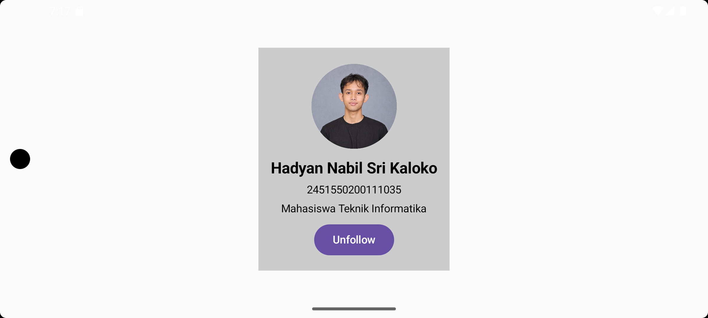
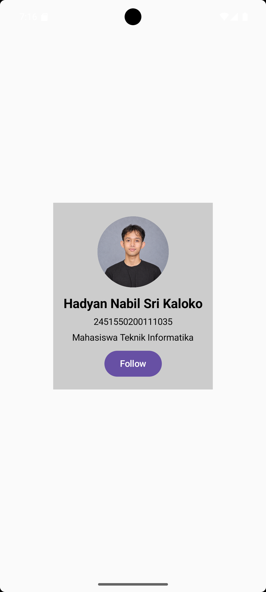

# ProfilApp

ProfilApp merupakan aplikasi Android sederhana berbasis **Jetpack Compose** yang menampilkan profil mahasiswa serta interaksi tombol **Follow/Unfollow**. Project ini dibuat sebagai implementasi konsep dasar UI pada Jetpack Compose.

## Identitas

- **Nama:** Hadyan Nabil Sri Kaloko
- **NIM:** 2451550200111035

## Penjelasan Kode

Implementasi utama aplikasi berada pada file `MainActivity.kt`.

- `setContent`: Menampilkan antarmuka Jetpack Compose ketika aplikasi dijalankan.
- `ProfileScreen`: Composable utama yang menyusun seluruh tampilan profil.
- `Column`: Menyusun komponen profil secara vertikal.
- `Image`: Menampilkan foto profil dari resource `drawable`.
- `CircleShape`: Membuat tampilan foto profil berbentuk lingkaran.
- `Text`: Menampilkan nama, NIM, dan deskripsi singkat mahasiswa.
- `Spacer`: Memberikan jarak antar komponen agar tampilan lebih rapi.
- `Modifier`: Mengatur ukuran, padding, posisi, dan warna latar belakang komponen.
- `FollowButton`: Composable untuk tombol interaktif Follow dan Unfollow.
- `remember` dan `mutableStateOf`: Menyimpan status tombol agar tampilan dapat berubah ketika tombol ditekan.

State pada tombol didefinisikan sebagai berikut:

```kotlin
var isFollowed by remember { mutableStateOf(false) }
```

Saat tombol ditekan, nilai `isFollowed` dibalik dari `false` menjadi `true` atau sebaliknya. Perubahan state tersebut membuat teks tombol otomatis berubah antara **Follow** dan **Unfollow**.

## Screenshot Aplikasi

<table>
  <tr>
    <th>Landscape</th>
    <th>Portrait</th>
  </tr>
  <tr>
    <td align="center">
      
    </td>
    <td align="center">
      
    </td>
  </tr>
</table>

## Keuntungan Jetpack Compose Dibandingkan XML Layout

Jetpack Compose menggunakan pendekatan deklaratif. Pengembang mendeskripsikan tampilan yang diinginkan menggunakan fungsi-fungsi Composable seperti `Column`, `Image`, `Text`, dan `Button`. Ketika state berubah, Compose akan memperbarui bagian UI yang terkait secara otomatis.

Pada pendekatan XML tradisional, struktur tampilan biasanya ditulis pada file XML, sedangkan logika aplikasi ditulis pada file Kotlin atau Java. Jetpack Compose memungkinkan UI dan interaksinya ditulis menggunakan Kotlin sehingga proses pengembangan menjadi lebih ringkas dan tidak perlu terlalu sering berpindah antara file layout dan file program.

Dari sisi pemeliharaan, struktur UI pada Compose lebih mudah ditelusuri karena susunan komponen dapat langsung dilihat pada fungsi Composable. Selain itu, Composable dapat dipisahkan menjadi fungsi tersendiri, seperti `FollowButton()`, sehingga kode lebih modular dan dapat digunakan kembali.

## Struktur File Utama

```text
app/
└── src/
    └── main/
        ├── java/
        │   └── .../
        │       └── MainActivity.kt
        └── res/
            └── drawable/
                └── profil.png

screenshots/
├── landscape.png
└── portrait.png

README.md
```

## Cara Menjalankan Aplikasi

1. Buka project menggunakan Android Studio.
2. Tunggu proses Gradle selesai.
3. Pilih emulator atau perangkat Android.
4. Tekan tombol **Run**.
5. Tekan tombol **Follow** untuk menguji perubahan menjadi **Unfollow**.
6. Ubah orientasi perangkat untuk menguji tampilan portrait dan landscape.
